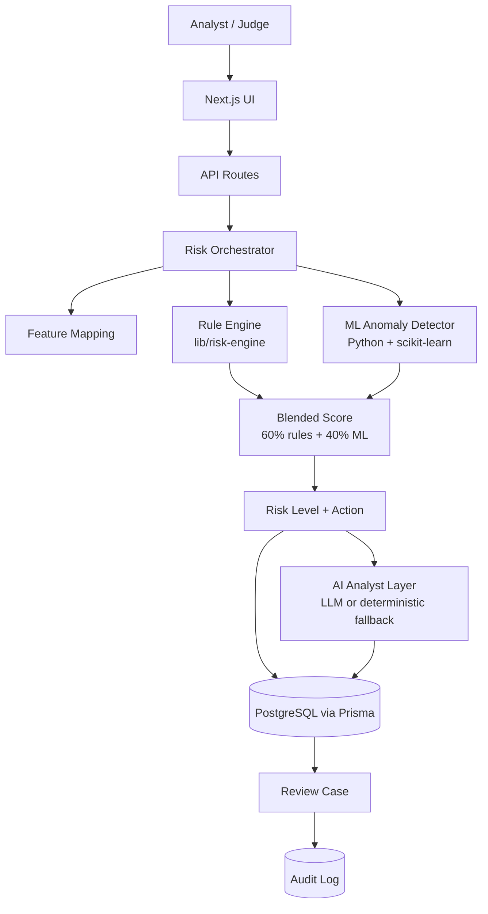

# RiskShield AI

**Explainable AI for smarter payment risk decisions.**

RiskShield AI is a hackathon/demo payment-risk-management platform. It detects suspicious
transactions, calculates a transparent 0–100 risk score, explains exactly *why* a transaction
received that score, recommends a next action, and gives a human risk analyst a real operations
dashboard to review and act on everything.

> ⚠️ **This is a hackathon/demo project.** It is **not** an official product of Razorpay or any
> other payment company, it does not connect to any real payment system, and it uses only
> **synthetic, generated data** — no real customers, cards, or transactions are involved anywhere.

---

## Problem

Traditional rule-only fraud systems have a few well-known problems:

- Too many false positives, which wastes analyst time and annoys good customers
- Risk decisions that are hard to explain, especially to a customer or a regulator
- Static rules that don't adapt as behavior changes
- Poor visibility into *why* something was flagged
- Analysts stuck manually investigating cases with no assistant to summarize evidence

## Solution

RiskShield AI combines three layers that each do one job well, rather than asking a single AI
model to do everything:

1. **A deterministic, explainable rule engine** — every point added to a score traces back to a
   specific, calculated fact about the transaction.
2. **A machine learning anomaly detector** (Isolation Forest) — catches unusual combinations of
   behavior the hand-written rules might not anticipate.
3. **An AI analyst layer** — turns the evidence from (1) and (2) into a plain-English
   investigation summary for a human reviewer, clearly separating *observed facts* from
   *AI inference*, and works even with **zero API keys configured** via a deterministic fallback.

The AI never replaces the risk engine and never makes the final call — a human analyst always
does, through the Review Queue and Case Investigation pages.

---

## Features

- **Analyst login & signup** — the dashboard is an internal tool for Razorpay-style risk
  analysts (not for the end customers whose transactions are being analyzed). Every page is
  protected; you must log in to see anything past the landing page.
- **Risk Operations Dashboard** — live totals, risk distribution, 30-day trend, top risk
  factors, and the most recent high-risk transactions.
- **Transaction Detail pages** — full feature breakdown, a visual risk meter, and the exact
  list of risk factors (with point values) behind the score.
- **Explainable Risk Engine** — 7 weighted, configurable categories (amount anomaly, velocity,
  device, location, failed attempts, account age, behavioral/compound patterns).
- **AI Risk Analyst ("RiskShield Analyst")** — a floating chat widget you can ask things like
  *"Why was TXN-100045 flagged?"* or *"What are the major risk patterns?"*, plus a
  one-click **"Analyze with AI"** investigation summary on every transaction.
- **Recommended Action Engine** — action depends on *which* factors fired, not just the score
  (e.g. a CRITICAL score built mostly from a weak ML signal is routed to a human instead of
  auto-blocked).
- **Human Review Queue** — a filterable case list with status (Open / Investigating /
  Escalated / Resolved / False Positive), assigned analyst, and recommended action.
- **Case Investigation** — full case view with Approve / Escalate / Request Verification /
  Block / Mark False Positive buttons, analyst notes, and a complete audit trail.
- **Audit Log** — every status change and AI analysis run is recorded with a timestamp, analyst,
  and reason.
- **Transaction Simulator** — build a hypothetical transaction and watch the whole pipeline score
  it live, with 5 one-click demo scenarios (Normal, Suspicious New Device, Velocity Attack,
  Account Takeover, High-Value Anomaly).
- **Analytics** — risk trend over time, risk by location/payment method/device familiarity, top
  risk factors, and review outcomes.
- **Settings** — system status (database, AI provider, ML model), and the current risk engine
  configuration, all read live rather than hard-coded in the UI.

---

## Architecture



The AI layer sits *after* the risk engine, not instead of it — it explains and summarizes a
score that was already calculated deterministically.

---

## Tech Stack

| Layer      | Technology                                             |
|------------|---------------------------------------------------------|
| Frontend   | Next.js 14 (App Router), TypeScript, React, Tailwind CSS |
| Charts     | Recharts                                                |
| Backend    | Next.js API routes (Node.js)                            |
| Database   | PostgreSQL + Prisma ORM                                  |
| ML         | Python 3 + scikit-learn (Isolation Forest) + pandas      |
| AI         | Provider-agnostic abstraction (OpenAI or Anthropic) with a deterministic fallback |
| Validation | Zod on every API route                                   |
| Testing    | Vitest                                                    |
| Infra      | Docker + Docker Compose                                   |

---

## Risk Engine

Lives entirely in `lib/risk-engine/`, with **zero database or UI dependencies** — it's pure,
testable TypeScript.

| Category              | Max Points | Signal                                                            |
|-----------------------|:---------:|--------------------------------------------------------------------|
| `amount_anomaly`       | 20        | How many times larger the amount is than the customer's average    |
| `velocity_risk`        | 20        | Transactions in the last 10 minutes / 24 hours                      |
| `device_risk`          | 15        | Device never seen before, and how recently it was first seen        |
| `location_risk`        | 15        | Location never seen before, and whether it differs from the last one|
| `failed_attempt_risk`  | 10        | Failed attempts right before this transaction                       |
| `account_risk`         | 10        | How new the account is                                              |
| `behavioral_anomaly`   | 10        | Multiple independent flags occurring together (compound/takeover pattern) |

```
Final Risk Score = 0.60 × Rule Engine Score + 0.40 × ML Anomaly Score

  0–29   → LOW       → Approve
  30–59  → MEDIUM     → Monitor (or Verify if velocity/behavioral signals are acute)
  60–79  → HIGH       → Request Verification (or Manual Review if it looks like account takeover)
  80–100 → CRITICAL   → Block (or Manual Review if the rule evidence itself is weak)
```

All weights and thresholds live in `lib/risk-engine/config.ts` — nothing is hard-coded inside a
UI component, and every explanation shown to the user is generated directly from the same
calculation, never fabricated separately.

---

## ML Model

`ml/training/generate_dataset.py` generates 1,000–5,000 realistic **synthetic** transactions
across ~220 synthetic customers, with correlated (but deliberately *not perfectly separable*)
fraud patterns. `ml/training/train_model.py` trains an **Isolation Forest** (unsupervised —
it never sees the ground-truth label as an input) on 8 behavioral features and scores every
transaction 0–100.

On the generated dataset, flagging the top 10% most anomalous transactions catches real planted
fraud/suspicious activity with roughly **66% precision and 72% recall** — good enough to be a
useful second signal, not so good that it looks unrealistically perfect.

At request time, `lib/ml/anomaly.ts` calls a short-lived Python subprocess
(`ml/inference/predict.py`) to score a single new transaction (used by the Transaction
Simulator and the re-analyze endpoint). **If Python or the model file isn't available, the app
automatically falls back to a simple statistical heuristic** instead of crashing — the risk
pipeline always produces a result.

---

## AI Layer

`lib/ai/provider.ts` defines one abstraction (`AIProvider`) with two implementations (OpenAI,
Anthropic), selected purely by the `AI_PROVIDER` environment variable. No API key is ever
hard-coded.

- **With a key configured:** `lib/ai/analyst.ts` sends the model *only* the already-calculated,
  structured evidence (risk factors, scores, transaction features) and instructs it to use only
  that evidence, distinguish observed facts from inference, and say so if the evidence is
  insufficient.
- **Without a key (or if the call fails for any reason):** `lib/ai/fallback.ts` builds the exact
  same shape of investigation summary from the same structured data, using plain templates
  instead of a generated model. The UI clearly labels which one you're looking at.

This is what makes "AI analysis works when configured" and "AI fallback works without a key"
both true — the demo never breaks because a key is missing.

---

## Authentication

A deliberately simple, self-contained system — no external auth service required:

- Passwords are hashed with **bcryptjs** (pure JavaScript, so it never needs a native binary
  to be compiled for your machine — a common source of install pain on Windows).
- A signed JWT session token (via **jose**, which works on Next.js's Edge Runtime) is stored in
  an `httpOnly` cookie.
- `middleware.ts` checks that cookie on every request and redirects to `/login` if it's missing
  or invalid — this runs *before* any protected page or API route executes.
- The `User` model represents **Razorpay-style risk analysts** (the people who log in and use
  this dashboard) — not the `Customer` model, which represents the end-users whose payment
  transactions are being analyzed. Customers never log into RiskShield AI.

## Database Schema

Nine Prisma models: `User`, `Customer`, `Device`, `Transaction`, `RiskAssessment`,
`RiskFactor`, `Case`, `CaseNote`, `AuditLog`. See `prisma/schema.prisma` for full field-level
detail, relationships, and indexes.

---

## Local Setup

You'll need **Node.js 18+**, **Python 3.9+**, and a **PostgreSQL** database (local install or
Docker — see below).

### Step 1 — Install dependencies

```bash
npm install
pip install -r ml/requirements.txt --break-system-packages   # omit the flag if you're using a virtualenv
```

### Step 2 — Start PostgreSQL

**Option A — Docker (easiest):**
```bash
docker compose up -d db
```
**Option B — a Postgres install you already have:** just make sure a database called
`riskshield` exists and matches the connection string in your `.env` (next step).

### Step 3 — Configure environment variables

```bash
cp .env.example .env
```
The default `DATABASE_URL` in `.env.example` already matches the Docker Compose setup above.
**Change `AUTH_SECRET` to your own random string** (anything 32+ characters works — it's what
signs analyst login sessions). See [Environment Variables](#environment-variables) below for
what each one does.

### Step 4 — Set up the database

```bash
npx prisma generate
npx prisma migrate dev --name init
```

### Step 5 — Generate the synthetic dataset and train the ML model

```bash
npm run ml:generate-data
npm run ml:train
```

### Step 6 — Seed the database

```bash
npm run seed
```
This reads the scored dataset from Step 5, runs every transaction through the *real* risk
engine, and creates review cases with a realistic mix of statuses. It'll print a summary like:
```
Seed complete.
  Customers: 220
  Transactions: 3676
  HIGH risk: 118
  CRITICAL risk: 61
  Review cases created: 340
```
(If you skip Steps 5–6's dataset/model generation, `npm run seed` will try to run them for you
automatically the first time.)

### Step 7 — Run it

```bash
npm run dev
```
Open **http://localhost:3000**.

---

## Environment Variables

See `.env.example` for the canonical list.

| Variable               | Required? | Description                                                        |
|------------------------|:---------:|------------------------------------------------------------------|
| `DATABASE_URL`          | Yes       | PostgreSQL connection string                                        |
| `AUTH_SECRET`           | Yes       | Long random string used to sign analyst login sessions. Change it from the placeholder before real use. |
| `AI_PROVIDER`           | No        | `openai`, `anthropic`, or `none`/unset. Defaults to the deterministic fallback if unset. |
| `AI_API_KEY`            | No        | API key for the chosen provider. Leave blank to use the fallback.   |
| `AI_MODEL`              | No        | Model name override (e.g. `gpt-4o-mini`, `claude-sonnet-4-6`).      |
| `NEXT_PUBLIC_APP_URL`   | No        | Used for absolute links in dev; defaults to `http://localhost:3000`.|
| `ML_PYTHON_BIN`         | No        | Override the Python executable name if `python3` isn't on your PATH (Windows users usually need to set this to `python`). |

### Logging in

After seeding, log in at `/login` with any of the demo analyst accounts the seed script prints,
for example:
```
analyst1@riskshield.demo   password: demo1234
```
Or click "Sign Up" on the landing page to create your own analyst account.

---

## Running the Application

```bash
npm run dev      # development server with hot reload
npm run build    # production build
npm start        # run the production build
```

## Running Tests

```bash
npm test           # runs the full Vitest suite once
npm run test:watch # watch mode
npm run typecheck  # tsc --noEmit
npm run lint       # eslint
```

The test suite (`tests/unit/risk-engine.test.ts`) covers all of the required scenarios: low-risk
transactions scoring low, amount/device/failed-attempt/velocity anomalies each increasing the
score, the score always staying within 0–100, correct score→level mapping, explanations matching
the factors that actually fired, and recommended actions matching the risk level.

## Generating Demo Data

```bash
npm run ml:generate-data   # creates ml/training/data/synthetic_transactions.csv
npm run ml:train           # trains the model + creates the _scored.csv the seed script reads
npm run seed                # loads everything into Postgres via the real risk engine
```

Re-running `npm run seed` at any time wipes and regenerates the demo data — it's safe to run
repeatedly.

## Demo Walkthrough

This is the same 5-minute flow the app was designed around:

1. Log in at `/login` with a seeded demo analyst account (see [Logging in](#logging-in) above).
2. Open the **Dashboard** — see total transactions, high/critical-risk counts, and the trend chart.
2. Click into a **CRITICAL** transaction from "Recent High-Risk Transactions."
3. See its risk score (e.g. 91/100) on the visual meter, and the exact list of risk factors with
   point values.
4. Click **"Analyze with AI"** — get a structured investigation summary (works identically
   whether or not you've configured an API key).
5. Open its linked **Case** in the Review Queue.
6. Click **Escalate** — watch the status change and a new entry appear in the **Audit History**.
7. Go to the **Transaction Simulator**, click **"Account Takeover"** to auto-fill a suspicious
   scenario, then click **Analyze Transaction** — watch the score, factors, and recommended
   action calculate live.
8. Point out that the platform combines **deterministic explainable rules + an ML anomaly model
   + AI reasoning + a human in the loop** — the AI never makes the final call.

---

## Limitations

- **Demo scale, not production scale.** Pagination and indexes exist, but this hasn't been load
  tested against millions of rows.
- **Simulator transactions aren't persisted.** The Simulator is a sandbox for "what if" inputs —
  it never writes to the database, so it won't appear in the dashboard or review queue. This is
  intentional (keeps demo data clean), documented here in case you expected otherwise.
- **ML scoring calls a Python subprocess per request.** Fine for a demo; a real production system
  would run the model behind its own service (e.g. FastAPI) so it can be scaled and monitored
  independently — the code is already structured (`lib/ml/anomaly.ts`) so that swap wouldn't
  touch the rest of the app.
- **Single risk engine "model version."** Historical re-scoring if you change the weights in
  `lib/risk-engine/config.ts` requires re-running analysis on each transaction
  (`POST /api/transactions/analyze`) — there's no automatic backfill job.
- **Authentication is demo-grade, not production-hardened.** There's no rate limiting on login
  attempts, no password-reset flow, and no email verification. The core mechanics (hashed
  passwords, signed sessions, protected routes) are real and correct, but a production system
  would add those extra layers before going live.
- **Case notes and audit log entries still use freeform analyst-name strings** in a few places
  rather than a strict foreign key to the logged-in user, to keep the seed data simple. The
  `User` model itself is fully real and used for actual login.
- **This project was built and verified in a sandboxed environment without outbound access to
  Prisma's binary-download server**, so the exact commands `npx prisma generate` /
  `npx prisma migrate dev` / `npm run build` were not run end-to-end inside that sandbox (a
  network-policy limitation of that environment, not of Prisma). Instead, the schema was verified
  by applying the equivalent SQL directly to a live PostgreSQL instance and running every
  analytics query against real seeded data, and every non-database module (the risk engine, the
  ML pipeline, the AI fallback logic) was verified with real, passing automated tests. The whole
  codebase was also typechecked and linted clean using a temporary stand-in for Prisma's generated
  types. On a normal machine with regular internet access — which is what you have — the setup
  steps above work exactly as documented with no special handling required.

## Future Improvements

- Role-based permissions (e.g. only `senior_analyst`/`admin` can approve CRITICAL cases)
- Password reset / forgot-password flow and email verification
- A hosted FastAPI (or similar) ML inference service instead of a per-request subprocess
- Automatic re-scoring/backfill when risk engine weights change
- Webhooks / real transaction ingestion instead of only seed + simulator data
- A/B testing framework for comparing risk engine configurations
- Email/Slack notifications when a CRITICAL case is created

## Responsible AI

- The AI layer is only ever given **structured, already-calculated evidence** — it is explicitly
  instructed not to invent transaction details and to say so if evidence is insufficient.
- Every AI-generated summary is labeled as a **recommendation**; the final decision always
  belongs to a human analyst via the Review Queue.
- The app **never silently uses a random or fabricated score** — every point in every score
  traces back to a real calculated feature, and the same calculation produces the on-screen
  explanation (no separate, potentially-inconsistent explanation step).
- If the AI provider fails or isn't configured, the app **falls back to deterministic templates**
  rather than showing a broken or empty state.
- All data in this project is **synthetic**. No real customers, accounts, devices, or payment
  instruments are represented anywhere.
